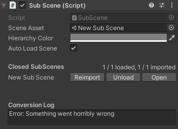
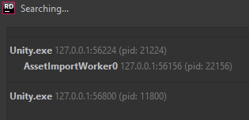
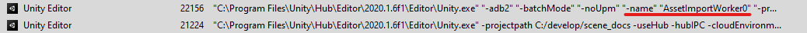
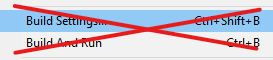
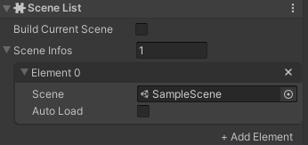

# Conversion errors

Improper usage of the Conversion Workflow can lead to some confusing problems. This page explains how to identify problems and debug the conversion process, then describes some of the most common errors.

## Where to look for errors

Conversion can happen in-process when using Live Conversion or in a background importer process. If one is broken, there's a high chance that the other is also broken (or merely *appears* to be working).

Aside from errors appearing in the Unity Console, background import errors will show up in the "Conversion Log" of the subscene MonoBehaviour.



The log file for the background asset import worker is located in the the "Logs" folder of your project. Look for "AssetImportWorker##.log", where ## will be a sequence number. The logs are overwritten every time the asset importer starts up normally, but when it has to be restarted after a crash, the sequence number will be incremented. So if you see multiple log files, they probably contain call stacks from crashes.

## Attaching a debugger

In order to debug the background asset import worker, you must attach a debugger to the background asset importer process. Some debuggers make this obvious, but for other debuggers, you may need to use your operating system's process manager to help you identify the right process.

* In the process hierarchy, look for the child process under Unity named "AssetWorker".

* If process command lines are available, look for the option that sets the AssetImportWorker name.


## Using the wrong entity manager

Conversion reads data from one world (conversion world) and writes to another (destination world).

A `MonoBehaviour` that implements `IConvertGameObjectToEntity` only receives the `EntityManager` of the destination world, so there's no real danger of inadvertently writing to the conversion world.

A conversion system, in contrast, has two `EntityManager` properties, one itself called `EntityManager` (for the conversion world), the other called `DstEntityManager` (for the destination world). Be careful not to confuse the two:

```c#
public class SomeConversionSystem : GameObjectConversionSystem
{
    // WARNING - This example illustrates incorrect usage.
    protected override void OnUpdate()
    {
        Entities.ForEach((Entity entity, SomeAuthoringComponent component) =>
        {
            // By using the `EntityManager` property, this code is adding a component 
            // to an entity in the conversion world, which is probably not what 
            // the author intended. Instead, the code should use `DstEntityManager` to 
            // add the component to an entity in the destination world.
            EntityManager.AddComponent<SomeComponent>(entity);
        });
    }
}
```

The intent of the above is properly expressed this way:

```c#
public class SomeConversionSystem : GameObjectConversionSystem
{
    protected override void OnUpdate()
    {
        Entities.ForEach((SomeAuthoringComponent component) =>
        {
            // GetPrimaryEntity retrieves the entity corresponding to the authoring component.
            // It is in the destination world, changing it will affect the conversion output.
            Entity entity = GetPrimaryEntity(component);

            // DstEntityManager is the entity manager from the destination world.
            DstEntityManager.AddComponent<SomeComponent>(entity);
        });
    }
}
```

## Conversion order

Like for runtime systems, the order of conversion system `OnUpdate` calls is determined by sorting:

- The conversion world's hierarchy of groups is sorted recursively.
- Within a group, the sort is constrained by `UpdateBefore` and `UpdateAfter` attributes, *e.g.* if *Foo* is marked to update before *Bar* in the same group, then *Foo*'s update will be sorted to some position ahead of *Bar*'s.

Because the sorting within a group is otherwise just based on hashes of the system's names, changing a system's name or adding or removing systems from the world can affect the ordering of systems. So where order within a group matters, you should apply `UpdateBefore` or `UpdateAfter` constraints.

The following example demonstrates where lax ordering could go wrong. The code processes an `AuthoringComponentA` and adds `SomeComponent` to the destination entity, then it subsequently updates the value of that component based on the presence of an `AuthoringComponentB` on the same GameObject. This is dangerous because nothing guarantees that `ConversionSystemA` will run before `ConversionSystemB`.

```c#
public struct SomeComponent : IComponentData
{
    public int Value;
}

public class ConversionSystemA : GameObjectConversionSystem
{
    protected override void OnUpdate()
    {
        Entities.ForEach((AuthoringComponentA authoring) =>
        {
            var entity = GetPrimaryEntity(authoring);
            var component = new SomeComponent {Value = authoring.Value};
            DstEntityManager.AddComponentData(entity, component);
        });
    }
}

public class ConversionSystemB : GameObjectConversionSystem
{
    protected override void OnUpdate()
    {
        // This is dangerous, we cannot assume that ConversionSystemA has already run.
        Entities.WithAll<AuthoringComponentA>().ForEach((AuthoringComponentB authoring) =>
        {
            var entity = GetPrimaryEntity(authoring);
            var component = DstEntityManager.GetComponentData<SomeComponent>(entity);
            component.Value += authoring.Value;
            DstEntityManager.SetComponentData(entity, component);
        });
    }
}
```

Also keep in mind that nothing guarantees the conversion order of `IConvertGameObjectToEntity`. The code below *might* work correctly, but it might not:

```c#
public class AuthoringComponentA : MonoBehaviour, IConvertGameObjectToEntity
{
    public int AuthoringValue;

    public void Convert(Entity entity, EntityManager dstManager
        , GameObjectConversionSystem conversionSystem)
    {
        var component = new SomeComponent {Value = AuthoringValue};
        dstManager.AddComponentData(entity, component);
    }
}

public class AuthoringComponentB : MonoBehaviour, IConvertGameObjectToEntity
{
    public int AuthoringValue;

    public void Convert(Entity entity, EntityManager dstManager
        , GameObjectConversionSystem conversionSystem)
    {
        // This is dangerous, we cannot assume in which order the components
        // of a GameObject will be converted.
        if (gameObject.GetComponent<AuthoringComponentA>() != null)
        {
            var component = dstManager.GetComponentData<SomeComponent>(entity);
            component.Value += AuthoringValue;
            dstManager.AddComponentData(entity, component);
        }
    }
}
```

## Prefab instantiation during conversion

>[!WARNING]
>Prefab instantiation during conversion **does not work** and is **not supported**. The danger comes with it *appearing* to partially work in some cases. This section explains in some details why it doesn't work, to help with troubleshooting.

There are two main issues with instantiating a prefab during conversion:

1. The prefab itself is not fully converted at this point and is not yet ready for use.
2. Live Link requires each entity to have its own GUID at the end of conversion, but instantiating prefabs during conversion would create multiple entities with the same GUID.

### Prefab not ready

When a prefab is instantiated in the middle of conversion, some conversion systems have not yet run. Consequently, the prefab entity is not yet in its fully converted state (*e.g.* some components have not yet been added). As with other ordering issues, everything may *appear* to work correctly by luck of the sorting order and properties of the prefab, but this cannot be relied upon.

Also understand that a prefab's 'linked entity group' (a list of entities belonging to the entity) is only added at the end of conversion. Prefabs in the middle of conversion will be missing this list and won't instantiate properly.

### Live Link GUID

Live Link expects every entity created by conversion to have a unique GUID. Consequently, prefabs should not be instantiated during conversion because doing so creates entities with duplicate GUID's.

At the end of conversion, a check for duplicate GUID's is performed that will throw this error:
> DuplicateEntityGuidException: Found x EntityGuid components that are shared by more than one Entity.

## Missing default components

Entities created during conversion receive a core set of components (any combination of `Static`, `EntityGuid`, `Disabled`, `SceneSection`), depending on a few internal settings. A non-exhaustive list of things that will happen when some components are missing is:

1. If an entity is missing a `SceneSection` component at the end of conversion, it won't be serialized and so won't show up when the scene is loaded from disk. The following warning will show up in the conversion log: "Warning: x entities in the scene '&lt;scene&gt;' had no SceneSection and as a result were not serialized at all." If the authoring scene is opened, the entity will show up thanks to live conversion.
2. The exact opposite of point 1 will happen if the entity misses an `EntityGuid` component, it will be missing from the world when using live conversion, but will be present when loading the entity scene from disk.

In order to ensure the required components are always present, entity creation during conversion should only happen through `GameObjectConversionSystem.CreateAdditionalEntity` and never by calling `EntityManager.CreateEntity`. Also, make sure you are not accidentally removing the components, for example by calling `EntityManager.SetArchetype`.

## Missing `ConverterVersion` attribute

Background importing is triggered by changes to the authoring data and their dependencies. The conversion code itself, however, is not considered a dependency, so changes to the conversion systems will be ignored, even if the changes would affect the conversion output.

This problem is particularly pernicious because it will only manifest itself when only the code is changed, but when editing conversion code, it is common to also edit the authoring components and authoring scenes. So it will typically work fine on the machine where the change was made, but fail to reimport on another computer.

In order to prevent those issues, a [ConverterVersion](xref:conversion#the-converterversion-attribute) attribute should be added to your conversion systems and updated every time a change to the conversion code requires a reimport.

In the following conversion system, a change to the Y offset would not trigger a background reimport unless you also update the `ConverterVersion` attribute:

```c#
// If Fabrice updates this system, he should increment 2 to 3.
// If Brian updates the system, he should increment to 2 to 3 and also change the string to "Brian".
[ConverterVersion("Fabrice", 2)]
public class SomeConversionSystem : GameObjectConversionSystem
{
    protected override void OnUpdate()
    {
        Entities.ForEach((SomeAuthoringComponent component) =>
        {
            var entity = GetPrimaryEntity(component);
            var translation = DstEntityManager.GetComponentData<Translation>(entity);
            translation.Value.y += 1; // Y offset
            DstEntityManager.SetComponentData(entity, translation);
        });
    }
}
```

An `IConvertGameObject` should also use `ConverterVersion` in the same way:

```c#
[ConverterVersion("Fabrice", 2)]
public class SomeAuthoringComponent : MonoBehaviour, IConvertGameObjectToEntity
{
    public void Convert(Entity entity, EntityManager dstManager
        , GameObjectConversionSystem conversionSystem)
    {
        var translation = dstManager.GetComponentData<Translation>(entity);
        translation.Value.y += 1; // Y offset
        dstManager.SetComponentData(entity, translation);
    }
}
```

## Missing asset dependency

Changes to a scene's authoring data and referenced prefabs will trigger a background reimport, but changes to other assets will not unless they are explicitly registered.

The following demonstrates how to register an asset, in this case a scriptable object. Without the call to `DeclareAssetDependency`, changes to the asset would not trigger a reimport, so updating *OffsetY* would not move the converted entity.

Note that the asset must be saved to disk for the changes to trigger the reimport. Also note that asset dependencies require Unity 2020.2 to work reliably.

```c#
public class SomeAuthoringComponent : MonoBehaviour, IConvertGameObjectToEntity
{
    public SomeScriptableObject ScriptableObject;

    public void Convert(Entity entity, EntityManager dstManager
        , GameObjectConversionSystem conversionSystem)
    {
        conversionSystem.DeclareAssetDependency(gameObject, ScriptableObject);

        var translation = dstManager.GetComponentData<Translation>(entity);
        translation.Value.y += ScriptableObject.OffsetY;
        dstManager.SetComponentData(entity, translation);
    }
}
```

## Where is my missing entity scene?

The most common cause for a missing entity scene is mistakenly using the standard Unity build pipeline.

>[!WARNING]
>
>
>The "build settings" and "build and run..." menus are not compatible with DOTS projects.

A DOTS project can only be properly built with a build asset. See @install-setup.

A build that doesn't use a build asset won't contain any entity scenes, and if it's a debug build, it will output an error similar to this one:

```
The scene catalog has not been loaded yet
Could not open file <path>/c735fba2921f70d42bd6572a3cfa3e5b.entityheader for read 
```

The *catalog* file contains a list of all the scenes in a DOTS project and is used to map scene paths to GUIDs. The file is located at "StreamingAssets/catalog.bin" under the project's build folder, and the only way of generating is is by using the build asset.

If the catalog file itself is present, but an entity scene is missing, check that it is referenced in the "Scene List" in the build configuration asset.



>[!WARNING]
>* If the "Build Current Scene" checkbox is enabled, the "Scene Infos" list is ignored.
>* In order to be included in the build, entity scenes need to be referenced by a `SubScene` in at least one Unity scene.

The scenes sections and headers are located in the "StreamingAssets/SubScenes" folder. If the folder is missing or empty, that's another sign that the wrong build pipeline was used.
