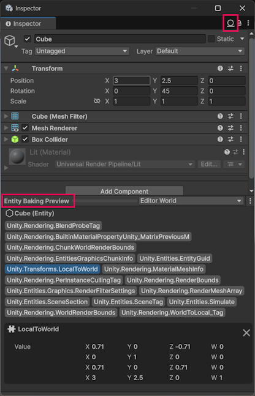
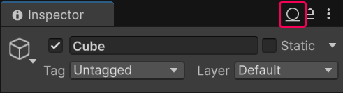
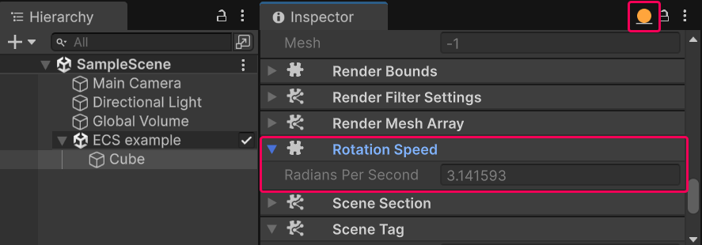

# ECS authoring and baking workflow

This section provides an example of the authoring and baking workflow in the Entity Component System (ECS).

The authoring and baking workflow in ECS connects the GameObject-based Editor experience with ECS high-performance runtime architecture. During authoring you can work with regular GameObjects and `MonoBehaviour` components in the Unity Editor. The baking process transforms these GameObjects into optimized ECS entities and components. The workflow separates the content creation experience from runtime performance concerns.

Topics in this section are workflow steps that depend on previous steps to work. If you are following along in the Editor, follow the steps in order:

1. [Create the subscene for the example](#create-subscene)
2. [Create an entity from a GameObject](#create-entity)
3. [Create a new ECS component](#create-component)
4. [Add a new component to an entity](#add-component)
5. [Create a system that rotates entities](#create-system)

## Prerequisites

This workflow requires a Unity 6 project with the following packages installed:

* [Entities](https://docs.unity3d.com/Packages/com.unity.entities@latest/index.html)
* [Entities Graphics](https://docs.unity3d.com/Packages/com.unity.entities.graphics@latest/index.html)

## <a id="create-subscene"></a>Create the subscene for the example

The first step in the Entity Component System (ECS) workflow is to create a [subscene](conversion-subscenes.md). ECS uses subscenes instead of scenes to manage the content for your application, because Unity's core [scene system](https://docs.unity3d.com/Documentation/Manual/CreatingScenes.html) is incompatible with ECS.

To create a subscene in Unity:

1. In the Editor, open an existing [scene](xref:CreatingScenes).
2. In the Hierarchy, right-click and select **New Sub Scene** > **Empty Scene**.
3. In the prompt that appears, enter the name for the new subscene and save it. Unity adds the subscene to the open scene and you can now use it.

## <a id="create-entity"></a>Create an entity from a GameObject

In this step you create an example GameObject and learn how the ECS framework converts GameObjects in a subscene into entities automatically. The process that ECS uses to convert GameObjects into entities is called [baking](baking.md).

To create an entity from a GameObject:

1. In the **Hierarchy** window, select a subscene.

2. Create a cube GameObject called **Cube** (menu path: **GameObject** > **3D Object** > **Cube**).

ECS converts the new cube GameObject into an entity automatically.

When you create a GameObject in a subscene, ECS converts it into an entity automatically during the [baking](baking.md) process.

Select the **Cube** GameObject. The **Inspector** window displays the **Entity Baking Preview** section. This section contains the entity components that ECS converted from the original GameObject.

<br/>Inspector window displaying the Entity Baking Preview section with Unity.Transforms.LocalToWorld selected.

For example, the **Unity.Transforms.LocalToWorld** component contains the transformation matrix that the rendering system uses to draw the entity. For the Cube entity, ECS creates this component using the information in the **Transform** component of the Cube GameObject. For more information, refer to [Transforms in Entities](transforms-intro.md).

## <a id="create-component"></a>Create a new ECS component

In ECS, components store entity data that [systems](concepts-systems.md) can read or write.

In this example, an ECS component contains the rotation speed of a cube.

ECS has multiple [component types](concepts-components.md#component-types), and this example uses the most common one, a component based on the `IComponentData` interface:

1. Create a new C# script called `RotationSpeed.cs` and replace the contents of the file with the following code example.

    [!code-cs[The Rotation Speed component](../DocCodeSamples.Tests/getting-started/RotationSpeed.cs#example)]

Now the project has a component that you can add to entities.

Unlike the GameObject workflow, you can't drag and drop an ECS component onto an entity.

In ECS there are two ways to add a component to an entity:

* Using the [baking](baking.md) process, where Unity adds an entity component when converting a GameObject into an entity.

* Using the [AddComponent](components-add-to-entity.md) API at runtime.

The next step demonstrates the former way of adding a component.

## <a id="add-component"></a>Add a new component to an entity

This step demonstrates how to add a component to an entity using the [baking](baking.md) process. In the baking process, ECS takes a regular `MonoBehaviour` component of a GameObject, and converts it into an entity component.

`MonoBehaviour` components that you create for the purpose of converting data into entity components are called authoring components. The authoring and baking process provides a way to define and edit properties of GameObjects using the Editor interface and convert them into corresponding ECS runtime components.

For information on adding components to entities without using the authoring and baking process, refer to the section [Add components to an entity](components-add-to-entity.md).

### Create an authoring component

An authoring component is a `MonoBehaviour` component that provides a way to pass data from GameObject fields in the Editor into ECS components.

To create an authoring component:

1. Create a new C# script called `RotationSpeedAuthoring.cs` and replace the contents of the file with the following code.

    [!code-cs[The MonoBehaviour component](../DocCodeSamples.Tests/getting-started/RotationSpeedAuthoring.cs#MonoBehaviour)]

2. Add the script to the **Cube** GameObject.

### Inspect a GameObject in Authoring and Runtime data modes

To understand the differences between GameObject and entity concepts better, inspect the cube GameObject in different [data modes](editor-authoring-runtime.md).

ECS provides two Inspector window data mode views: **Authoring** and **Runtime**. To switch between the modes, click the circle icon in the top-right corner of the Inspector window.



In the **Authoring** data mode, the Inspector window displays the **Degrees Per Second** property in the **Rotation Speed Authoring** component, as defined in the `RotationSpeedAuthoring` class.

Click the data mode circle and select **Runtime**. The Inspector window displays the entity data view. The view does not contain the **Degrees Per Second** property, or the **Rotation Speed** component. This is because the component only exists on the GameObject and there is no converter or baker that would convert it into an entity component yet.

The next step is to create a baker class that converts the `MonoBehaviour` component into an entity component. 

### Create the baker class

In ECS, the [Baker](xref:Unity.Entities.Baker`1) class defines the conversion of GameObject data into entity data.

Add the baker class to the authoring component:

1. In the `RotationSpeedAuthoring.cs` script, replace the contents of the file with the following code, which adds the `RotationSpeedBaker` class definition:

    [!code-cs[The baker class](../DocCodeSamples.Tests/getting-started/RotationSpeedAuthoring.cs#example)]

This class has the following main functions:

* The `Bake` method takes a `RotationSpeedAuthoring` instance as an argument. This argument refers to the authoring component on a GameObject. This is the method where you define your custom logic for converting GameObject data into ECS data.

* The `GetEntity` method returns an entity that ECS creates from the GameObject using pre-built ECS baker methods.

    ```lang-cs
    var entity = GetEntity(authoring, TransformUsageFlags.Dynamic);
    ```

    The argument `TransformUsageFlags.Dynamic` instructs the **Bake** method to add the **Transforms.LocalTransform** component to the entity. This example uses the **LocalTransform** component on a further step to rotate the cube. For more information, refer to [Transform usage flags](transforms-usage-flags.md).

* The following lines create a new instance of the **Rotation Speed** component, and the `AddComponent` method adds the component to the entity:

    ```lang-cs
    var rotationSpeed = new RotationSpeed
    {
        RadiansPerSecond = math.radians(authoring.DegreesPerSecond)
    };

    AddComponent(entity, rotationSpeed);
    ```

The new `RotationSpeed` component is an ECS component, and it's using the data from the `MonoBehaviour` authoring component.

Save the script and inspect the cube GameObject in the **Runtime** [data mode](editor-authoring-runtime.md). Now the cube has the **Rotation Speed** component with the **Radians Per Second** property.



The property name and units in the component are different from the `MonoBehaviour` authoring component, where the name is **Degrees Per Second** and the units are degrees. This illustrates a common practice where you can add extra processing when converting data from GameObjects into entities.

Now you have the following setup:

* A GameObject with the **Degrees Per Second** property in the **Rotation Speed Authoring** component, which you can edit from the Editor.

* An entity with the **Radians Per Second** property in the **Rotation Speed** component, which the ECS framework updates dynamically based on the changes on the GameObject.

The next step demonstrates how to create a system that rotates the cube entity.

## <a id="create-system"></a>Create a system that rotates entities

This task describes how to create an ECS system that rotates entities.

Unlike the GameObject workflow, in ECS you don't assign scripts directly to specific entities. Instead, a system queries for entities that match certain criteria in a world, and then performs actions on all of them.

### Create the rotation system

To create a rotation system:

1. Create a new C# script called `RotationSystem.cs` and replace the contents of the file with the following code: 

    [!code-cs[The system that rotates GameObjects](../DocCodeSamples.Tests/getting-started/RotationSystem.cs#example)]

2. Enter **Play** mode. The cube should spin in both the Game view and the Scene view.

When you enter Play mode, ECS automatically instantiates systems based on `ISystem` interface.

To affect entities, the system implements a [query](systems-systemapi-query.md) in the `OnUpdate` method. In each frame the system selects all entities that have both the **LocalTransform** and the **RotationSpeed** components, and executes the code defined in the `foreach` loop on them.

The following code in the system rotates entities around the Y axis:

```lang-cs
transform.ValueRW = transform.ValueRO.RotateY(speed.ValueRO.RadiansPerSecond * deltaTime);
```

[`ValueRW`](xref:Unity.Entities.RefRW`1.ValueRW*) and [`ValueRO`](xref:Unity.Entities.RefRO`1.ValueRO*) methods are special ECS methods that return a reference to the component and conduct a safety check for read-write (`ValueRW`) or read-only (`ValueRO`) access.

For more information about the transform operations, refer to the section [Transform operations](transforms-comparison.md).

The `[BurstCompile]` attribute indicates that the method should be compiled with the Burst compiler into highly-optimized native CPU code. For more information, refer to the [Burst compiler](https://docs.unity3d.com/Packages/com.unity.burst@latest) documentation.

To see the query functionality in action:

1. Create several more cube GameObjects in the subscene.

2. In the **Authoring** data mode, add the **Rotation Speed Authoring** component to some, but not all cubes.

3. On cubes that have the **Rotation Speed Authoring** component, change the **Degrees Per Second** values.

4. Enter **Play** mode.

    Only the cubes that have the **Rotation Speed Authoring** component rotate. Cubes rotate at a speed defined in the **Degrees Per Second** property.

## Additional resources

* [Introduction to the ECS workflow](ecs-workflow-intro.md)
* [Starter ECS workflow](ecs-workflow-example-starter.md)
* [Prefab instantiation workflow](ecs-workflow-example-prefab-instantiation.md)