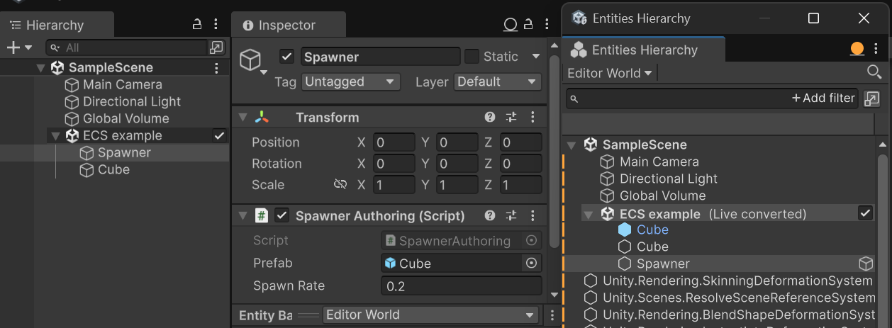
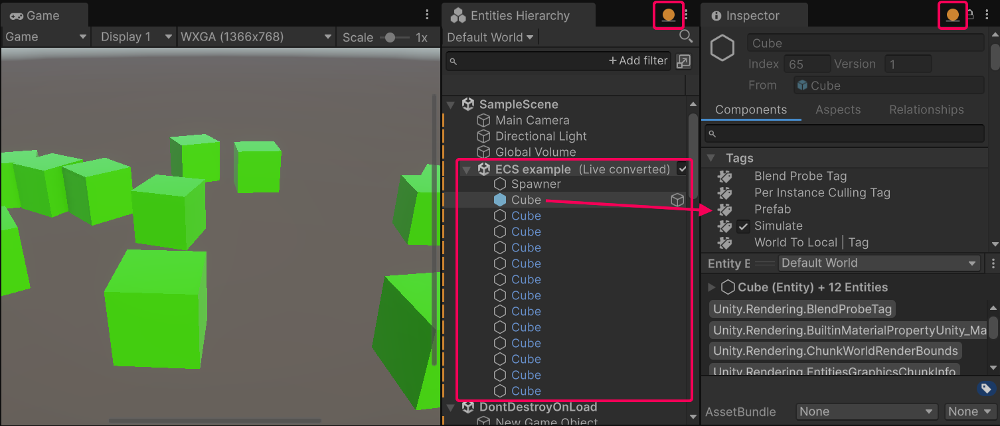

# Entity prefab instantiation workflow

This workflow demonstrates entity prefab instantiation in ECS. The workflow demonstrates the following concepts:

* Authoring GameObject component for controlling the instantiation using the Editor.
* Converting GameObject prefabs into ECS prefabs.
* Creating a Burst-compatible system.
* Optimizing a system to run across multiple threads. 

> [!NOTE]
> If you've followed the steps in the [Authoring and baking workflow example](ecs-workflow-example-authoring-baking.md), skip the first step that creates a subscene and start with [Create a spawner entity for instantiating prefabs](#create-spawner).

Topics in this section are workflow steps that depend on previous steps to work. If you are following along in the Editor, follow the steps in order.

1. [Create the subscene for the example](#create-subscene)
2. [Create a spawner entity for instantiating prefabs](#create-spawner)
3. [Create a system that instantiates prefabs](#create-system)
4. [Make the Spawner system multi-threaded](#multi-threading)

## Prerequisites

This workflow requires a Unity 6 project with the following packages installed:

* [Entities](https://docs.unity3d.com/Packages/com.unity.entities@latest/index.html)
* [Entities Graphics](https://docs.unity3d.com/Packages/com.unity.entities.graphics@latest/index.html)

## <a id="create-subscene"></a>Create the subscene for the example

The first step in the Entity Component System (ECS) workflow is to create a [subscene](conversion-subscenes.md). ECS uses subscenes instead of scenes to manage the content for your application, because Unity's core [scene system](https://docs.unity3d.com/Documentation/Manual/CreatingScenes.html) is incompatible with ECS.

To create a subscene in Unity:

1. In the Editor, open an existing [scene](xref:CreatingScenes).
2. In the Hierarchy, right-click and select **New Sub Scene** > **Empty Scene**.
3. In the prompt that appears, enter the name for the new subscene and save it. Unity adds the subscene to the open scene and you can now use it.

## <a id="create-spawner"></a>Create a spawner entity for instantiating prefabs

This example creates an authoring GameObject called **Spawner** to provide a way to control how prefabs are instantiated from the Editor. A baker class passes the data from the **Spawner** to a corresponding ECS entity.

1. In the subscene, create a new empty GameObject called **Spawner**.

2. Create a C# script called **SpawnerAuthoring.cs** and replace the contents of the file with the following code:

    [!code-cs[The Spawner authoring component](../DocCodeSamples.Tests/getting-started/SpawnerAuthoring.cs#example)]

    The spawner entity serves as a configuration object and is not meant to be rendered, so it doesn't need the Transform components. That's why the `GetEntity` call that converts the **Spawner** GameObject into an entity has the `TransformUsageFlags` enum set to `None`.

    ```lang-cs
    var entity = GetEntity(TransformUsageFlags.None);
    ```

    The `AddComponent` method adds the the `Spawner` component, which includes the `Prefab` field.

    The following `GetEntity` call converts a GameObject prefab into an [entity prefab](baking-prefabs.md). The prefab represents the rendered cubes, so it requires the standard Transform components, that's why the `TransformUsageFlags` enum set to `Dynamic`.

    ```lang-cs
    Prefab = GetEntity(authoring.Prefab, TransformUsageFlags.Dynamic)
    ```    

3. Create a prefab by dragging a cube with the **Rotation Speed Authoring** component to a folder in the **Project** window.

4. Select the **Spawner** GameObject. In the **Spawner Authoring** component, in the **Prefab** field, select the cube prefab.

The ECS framework converts a GameObject prefab into an entity prefab as soon as you select it in the **Prefab** field. To observe this behavior, do the following:

1. Open the **Entities Hierarchy** window using the menu **Window** > **Entities** > **Hierarchy**.

2. In the regular **Hierarchy** window, select the **Spawner** GameObject.

3. In the **Entities Hierarchy** window, switch to the **Runtime** data mode.

    If the **Spawner** GameObject has the **Cube** prefab selected in the Prefab field, the **Entities Hierarchy** should display a view similar to this:

    

    The screenshot displays the following:

    * The regular **Hierarchy** window with the **Spawner** GameObject.
    * The **Inspector** window in the **Authoring** [data mode](editor-authoring-runtime.md). You can edit the properties on the **Spawner** GameObject from the Editor.
    * The **Entities Hierarchy** window in the **Runtime** [data mode](editor-authoring-runtime.md). In addition to the Spawner entity, this window displays the **Cube** entity prefab, which has the blue icon next to it. The `GetEntity` method call in the code example converts the original GameObject prefab into the entity prefab.

The next step describes how to create a system that instantiates the entity prefab.

## <a id="create-system"></a>Create a system that instantiates prefabs

This section describes how to create a system that instantiates entity prefabs and sets component data on them.

Create a new C# script called `SpawnerSystem.cs` and replace the contents of the file with the following code:

[!code-cs[The system that instantiates prefabs](../DocCodeSamples.Tests/getting-started/SpawnerSystem.cs#example)]

ECS systems are not attached to specific entities, which means that a system's `OnUpdate` method might run before Unity loads a scene and initializes an entity that the system depends on. Executing the [RequireForUpdate](xref:Unity.Entities.SystemState.RequireForUpdate*) method ensures that the system does not run before an entity of type `Spawner` is initialized in the world:

```lang-cs
state.RequireForUpdate<Spawner>();
```

In this example, there is only one spawner entity in the subscene, so instead of using a query you can use the [GetSingleton](xref:Unity.Entities.SystemAPI.GetSingleton*) method to get the entity:

```lang-cs
Spawner spawner = SystemAPI.GetSingleton<Spawner>();
```

The system instantiates entity prefabs using the [EntityManager.Instantiate](xref:Unity.Entities.EntityManager.Instantiate*) method. The `Prefab` field of the `spawner` variable contains a reference to the entity prefab which ECS converts on the baking stage:

```lang-cs
Entity newEntity = state.EntityManager.Instantiate(spawner.Prefab);
```

To avoid instantiating entities in the same location, the example uses the [SetComponentData](xref:Unity.Entities.EntityManager.SetComponentData*) method to set the `LocalTransform` values on each new entity to a random position within a small vicinity from the spawner position:

```lang-cs
state.EntityManager.SetComponentData(newEntity, LocalTransform.FromPosition(newPosition));
```

The [Random](https://docs.unity3d.com/Packages/com.unity.mathematics@latest/index.html?subfolder=/manual/random-numbers.html) method in the example is from the [Unity Mathematics](https://docs.unity3d.com/Packages/com.unity.mathematics@latest/index.html?subfolder=/manual/index.html) package. The [Unity Mathematics](https://docs.unity3d.com/Packages/com.unity.mathematics@latest/index.html?subfolder=/manual/index.html) package provides types and functions optimized for Burst.

### Try the system in action

Enter **Play** mode. The `SpawnerSystem` system starts creating instances of entity prefabs at the rate specified in the **Spawn Rate** property of the **Spawner** GameObject.

If you followed the instructions in the [Authoring and baking workflow example](ecs-workflow-example-authoring-baking.md) and your project has the `RotationSystem.cs` script, the prefabs should spin in the **Game** view.

Pause **Play** mode. Open the [**Entities Hierarchy**](editor-hierarchy-window.md) window and switch to the **Runtime** [data mode](editor-authoring-runtime.md).



The window highlights the source entity prefab with the solid blue icon, and the instantiated entity prefabs with hollow grey icons and blue names.

Select the source entity prefab and view it in the **Inspector** window in the **Runtime** [data mode](editor-authoring-runtime.md). Notice that it has the **Prefab** tag in the **Tags** section. This tag excludes the source prefab from system queries that affect the instances of the prefab.

## <a id="multi-threading"></a>Make the Spawner system multi-threaded

This task shows you how to modify a system so that it runs [jobs](xref:JobSystem) in parallel on multiple threads.

> [!NOTE]
> Before you modify a system to run in parallel on multiple threads, consider whether your system affects data on enough entities to make the benefits of multi-threading exceed the overhead of scheduling the jobs. For more information, refer to [Optimize systems](ecs-workflow-intro.md#optimize-systems).

This task recreates `SpawnerSystem` using [IJobEntity](xref:Unity.Entities.IJobEntity) and schedules the job to run in parallel across multiple threads. Using an `IJobEntity` changes how you query and iterate over component data, and changes how you instantiate new entities. For information on component data query and iteration changes due to `IJobEntity`, refer to [Specify a query](iterating-data-ijobentity.md#specify-a-query). 

Unity can only create entities on the main thread which means parallel jobs must use an [entity command buffer](systems-entity-command-buffers.md) to record commands to create and configure new entities. After the parallel job runs, Unity plays back the entity command buffer on the main thread to actually create and configure the entities. For more information, refer to [Use EntityCommandBuffer in a parallel job](systems-entity-command-buffer-use.md#parallel-jobs) and [Deterministic playback](systems-entity-command-buffer-playback.md#deterministic-playback-in-parallel-jobs).

### Update the Spawner system

1. Open the `SpawnerSystem.cs` script.
2. Replace the contents of the file with the below code example.
3. Duplicate the **Spawner** GameObject in the subscene so that you have at least 300 Spawner GameObjects. This is to ensure that there are enough entities for ECS to split the work among multiple threads.
3. Enter Play mode. You should see that the system behaves as it did previously. However, if you open the [Profiler](xref:Profiler) window, you should see that the work runs on multiple threads.

[!code-cs[Multi-threaded Spawner system](../DocCodeSamples.Tests/getting-started/SpawnerSystemMultithreaded.cs#example)]

Note that the `BeginSimulationEntityCommandBufferSystem` is used to create the entity command buffer. This is a system which runs at the start of the `SimulationSystemGroup`, and it ensures that the entity command buffer is played back at the beginning of the Update phase of the player loop. For more information on default system groups see [System groups](systems-update-order.md).

## Additional resources

* [Introduction to the ECS workflow](ecs-workflow-intro.md)
* [Starter ECS workflow](ecs-workflow-example-starter.md)
* [Authoring and baking workflow example](ecs-workflow-example-authoring-baking.md)
