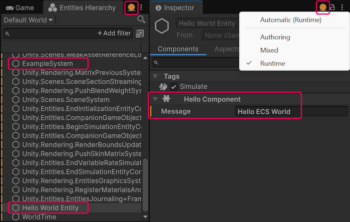

# Starter ECS workflow

This example demonstrates a basic Entity Component System (ECS) workflow, and includes the following tasks:

1. Create an ECS component.
2. Create an ECS system that creates an entity and adds a component to it.
3. View the entity in the **Entities Hierarchy** window in **Runtime** [data mode](editor-hierarchy-window.md).

## Prerequisites

This workflow requires a Unity 6 project with the Entities package installed.

## Create an ECS component

ECS has multiple [component types](concepts-components.md#component-types), and this example uses the most common one, a component based on the `IComponentData` interface.

The example component type is a struct. It's an unmanaged type which has a lot of performance benefits compared with GameObject components, which are always managed types.

To create an ECS component:

1. Create a new C# script called `HelloWorld.cs` and replace the contents of the file with the following code example.

    [!code-cs[The HelloComponent component](../DocCodeSamples.Tests/getting-started/HelloWorld.cs#HelloComponent)]

The `HelloComponent` component contains a `Message` variable of type `FixedString32Bytes`. Since `struct IComponentData` can only contain unmanaged types, you cannot use a regular C# `string` type variable. This example uses the `FixedString32Bytes` type, which is an unmanaged type, and has a fixed size.

Now the project has an ECS component that you can add to entities.

## Create an ECS system

In ECS, you use systems to create and manipulate entities and components. An ECS system is a struct that implements the `ISystem` interface.

To create an ECS system:

1. In the `HelloWorld.cs` script, add the following struct based on the `ISystem` interface:

    [!code-cs[The HelloComponent component](../DocCodeSamples.Tests/getting-started/HelloWorld.cs#ExampleSystem)]

2. Enter **Play** mode.

    The console displays the `Hello ECS World` message.

The system creates a new entity in the [OnCreate](xref:Unity.Entities.ISystem.OnCreate*) method, and adds an instance of the `HelloWorld` component to that entity.

In the `OnUpdate` method, the system uses a query expression to find all entities that have the `HelloComponent` component, and writes a message from the component in the console.

## View the entity in Entities Hierarchy window

The system creates the entity at runtime, which means that the entity is only visible in the Editor when you enter **Play** mode. Since the entity is not a GameObject, it’s not visible in the regular **Hierarchy** window. ECS provides a special [**Entities Hierarchy**](editor-hierarchy-window.md) window where you can view entities in an [ECS world](concepts-worlds.md).

To view the entity that the system creates:

1. Open the **Entities Hierarchy** window using the menu **Window** > **Entities** > **Hierarchy**.

2. Enter Play mode.

3. In the **Entities Hierarchy** window, switch to the **Runtime** [data mode](editor-hierarchy-window.md).

4. The **Entities Hierarchy** window displays the new entity with the `Hello World Entity` name, as defined in the `EntityManager.SetName` method.

5. Select the new entity and view it in the **Inspector** window in the **Runtime** data mode. The Inspector window displays the `Hello Component`.

    

## Complete code

This is the complete code of the `HelloWorld.cs` script:

[!code-cs[Complete code of the RotationSpeedAuthoring.cs script](../DocCodeSamples.Tests/getting-started/HelloWorld.cs#example)]

## Additional resources

* [Introduction to the ECS workflow](ecs-workflow-intro.md)
* [Authoring and baking workflow example](ecs-workflow-example-authoring-baking.md)
* [Prefab instantiation workflow](ecs-workflow-example-prefab-instantiation.md)