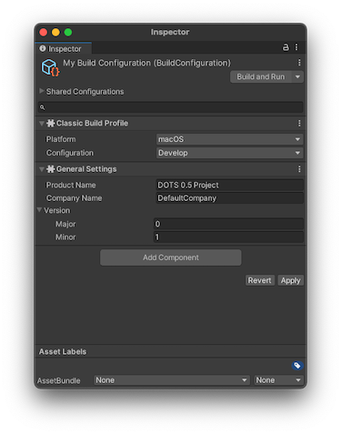
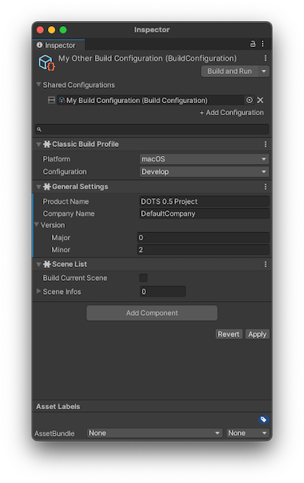

# Building an Entities project

To build your Entities project, you must install the [Entities Platforms package](https://docs.unity3d.com/Packages/com.unity.platforms@latest), which adds a new build workflow to your project. You use Build Configuration assets to build your application, rather than using the [Build window](https://docs.unity3d.com/Manual/BuildSettings.html). 

> [!IMPORTANT]
> The **Build** and **Build and Run** operations from the **Build Settings** window aren’t supported. If you're using subscenes and you attempt to build your project via these operations, your build fails to load because this operation doesn’t build any subscenes.

## Creating a Build Configuration asset 

> [!NOTE]
> You must install the [Entities Platforms package](https://docs.unity3d.com/Packages/com.unity.platforms@latest) before you can use this workflow.

To create a Build Configuration asset, go to menu: **Assets &gt; Create &gt; Build Configuration &gt; Empty Build Configuration.** This creates an empty Build Configuration asset in the project's **Assets** folder.

By default, the Build Configuration asset uses the settings in the project's [Build Settings](https://docs.unity3d.com/Manual/BuildSettings.html) and [Player Settings](https://docs.unity3d.com/Manual/class-PlayerSettings.html) to build your application. However, you can add override components to the Build Configuration asset to override some of these settings. To do this, select the **Add Component** button and then choose an override from the categories in the menu. 

 _Inspector window with a Build Configuration asset with override components added_

Select the **Apply** button to save the list of components. You can also use the **More menu (&#8942;)** to remove or reset an override.

### Shared Build Configuration assets

Build Configuration assets can inherit from each other. If you'd like a Build Configuration asset to share the same settings as another, use the **Shared Configuration** section of the Inspector window and select another Build Configuration asset. This copies over the same override components to this new asset.

You can add any extra override components, and additionally edit the settings in the shared components. This only edits the settings for this component, and if you do this, a blue line appears on the override component you've edited. To change the settings for all shared configurations you must edit the parent configuration. To easily find the parent configuration, select the **More menu (&#8942;)** and choose **Go to Configuration.**

 _Build Configuration asset with a Shared Configuration. The General Settings has been edited._

## Connecting to the Profiler
If you want to use the [Profiler](https://docs.unity3d.com/Manual/profiler-profiling-applications.html) to profile your application, you must set the **Configuration** in the **Classic Build Profile** section to either **Debug** or **Development**.

## Building your application

To build your application, select the Build button in the top of the Inspector window. You can choose from:

* **Build:** Builds your application into a player
* **Build and Run:** Builds your application into a player and then opens that player on the target platform
* **Run:** Runs the latest build, if any is available
* **Clean:** Removes the build, including all built files
