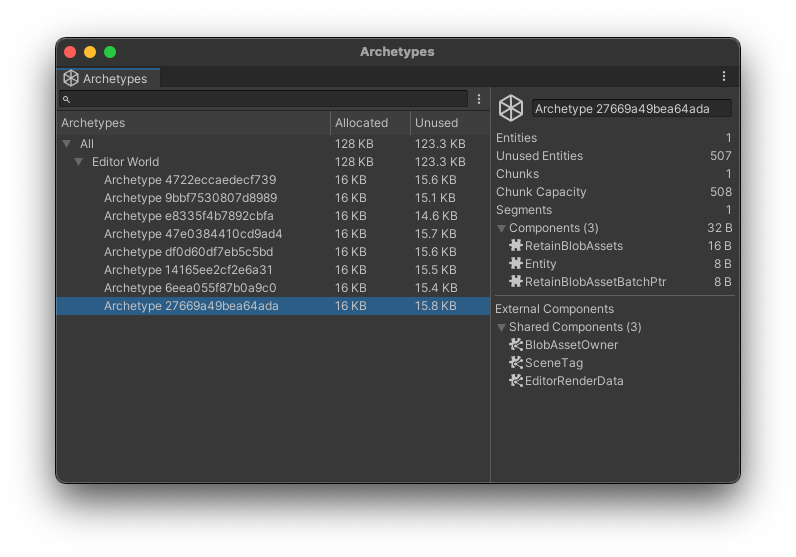

# Archetypes window reference

The Archetypes window displays how much allocated and unused memory ECS has allocated to each [archetype](concepts-archetypes.md) in your project. It contains a list of archetypes across all the worlds in your project, which indicates the current memory layout of the ECS framework.

To open the Archetypes window, go to **Window &gt; Entities &gt; Archetypes**.

 _Archetypes window with an archetype selected_

To see more information about an archetype, click to select it. The information appears in the panel on the right. 

To include the empty archetypes in your project in this list, open the More menu (⋮) and enable the **Show Empty Archetypes** setting. An empty archetype is one that has zero entities associated with it. Often, this happens when you use [`AddComponent`](xref:Unity.Entities.EntityManager.AddComponent*) to add components to an entity one at a time.

For each Archetype, the panel shows: 

| **Property** | **Description** |
|---|---|
| Archetype name | The archetype name is its hash, which you can use to find the archetype again across future Unity sessions. |
| Entities | Number of entities within the selected archetype. |
| Unused Entities | The total number of entities that can fit into all available chunks for the selected Archetype, minus the number of active entities (represented by the entities stat). |
| Chunks | Number of [chunks](concepts-archetypes.md#archetype-chunks) this archetype uses. |
| Chunk Capacity | The number of entities with this archetype that can fit into a chunk. This number is equal to the total number of **Entities** and **Unused Entities**. |
| Components | Displays the total number of components in the archetype and the total amount of memory assigned to them in KB.   To see the list of components and their individual memory allocation, expand this section. |
| External Components | Lists the [Chunk components](components-chunk.md) and [Shared components](components-shared.md) that affect this archetype. |

## Additional resources

* [Archetype user manual](concepts-archetypes.md)
* [Chunk user manual](concepts-archetypes.md#archetype-chunks)
* [Shared Components user manual](components-shared.md)
* [Chunk Components user manual](components-chunk.md)
