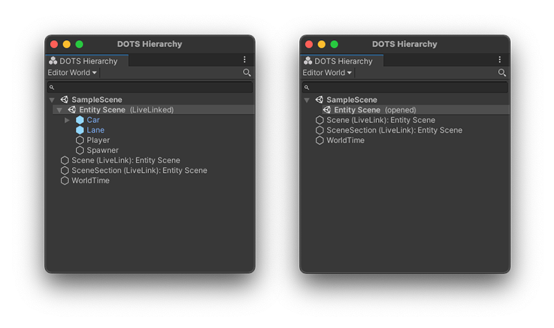

# DOTS Hierarchy window reference

The DOTS Hierarchy window is a read-only Editor window that you can use to see the [Entity hierarchy](ecs_entities.md) of each [World](world.md) in your project. In particular, it’s a useful window if you’re dealing with a lot of Entities that you want to search for and visualize in their hierarchy. 

To open the DOTS Hierarchy window, go to **Window &gt; DOTS &gt; Hierarchy**.

To select the Worlds in your project, use the drop-down in the top left of the window. You can also search for specific Entities by their name, ID, or Component. 

>[!TIP]
>To view more information about an Entity, select it in the list. Unity then displays it in the [Inspector](editor-inspectors.md) window. 

To see the full Entities hierarchy in both Edit mode and Play mode,  you must enable [real-time conversion](conversion_livelink.md) of GameObject data into Entities data (through menu: **DOTS &gt; Conversion Settings &gt; Live Conversion Enabled**). If you’ve disabled this setting, then the DOTS Hierarchy window only displays the full Entities hierarchy when you enter Play mode. 

 _DOTS Hierarchy window with Live Conversion enabled (Left) and disabled (Right)_

## Additional resources

* [Entities user manual](ecs_entities.md)
* [Entity Inspector reference](editor-entity-inspector.md)
* [World user manual](world.md)