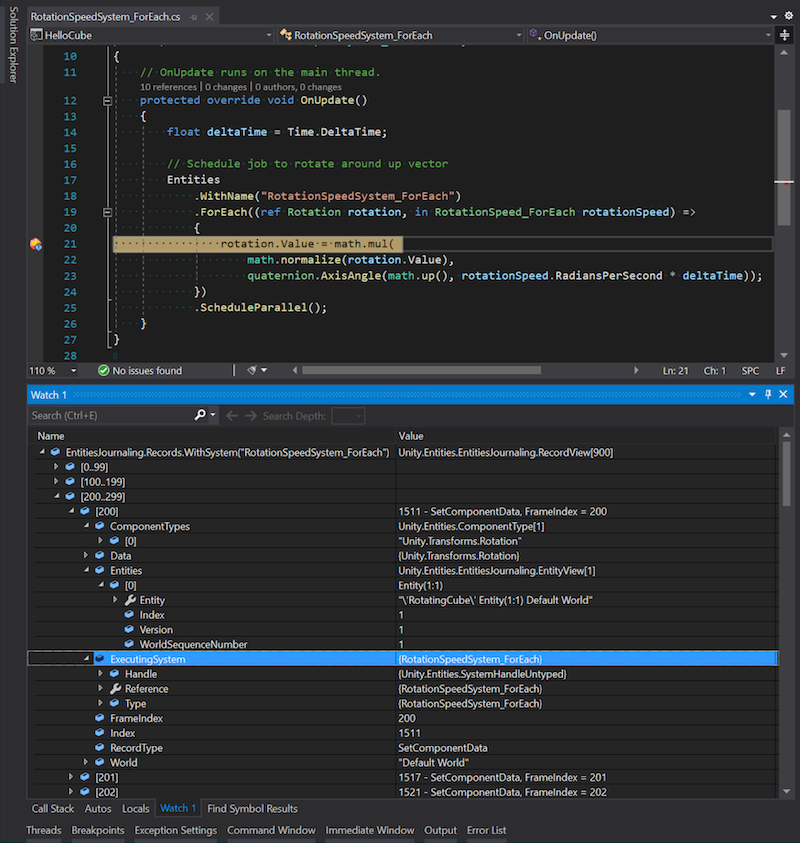

# Journaling

You can use Journaling to record every action that you perform in your project to help you debug your project. You can use the Journaling window, or your IDE to inspect the data it collects. For example, it records creating or destroying worlds or entities, or adding or removing systems or components.

## Enable Journaling

To enable Journaling, you can either:

* Open the Journaling window **Window &gt; Entities &gt; Journaling**
* Enable the option through the [Preferences](https://docs.unity3d.com/Manual/Preferences.html) window (**Preferences &gt; Entities &gt; Journaling**).

You can also use the preprocessor define `DISABLE_ENTITIES_JOURNALING` to remove all Journaling code from your projects, which can be useful for debugging your project.

## Assign memory to Journaling

To assign total memory to Journaling, adjust the value of the [Total Memory MB](editor-preferences.md) property in **Preferences &gt; Entities &gt; Journaling**.

The memory is assigned in MB. It's managed as a first in, first out system, which means that Unity overwrites the oldest Journaling records with the newest records when the memory is full. If you need to keep records for longer, increase the memory size to reduce overwrites.

## Journaling window

To open the Journaling window, go to **Window &gt; Entities &gt; Journaling**. When you open the window, it starts recording data. It records data in both Edit and Play mode. When you pause recording, the window displays the record types. You can select a record to inspect any systems, entities, or components associated with it. You can also use the search bar to quickly search for any records of interest.

 _The Journaling window_

Journaling records all `GetComponentDataRW` to capture all possible write operations to the data. However, this isn't useful if you want to find out which system was responsible for a particular value. For example, if you want to find out what set a field to NaN, Journaling only records what got access to the data and not the changes made to the data. Therefore, Unity converts `GetComponentDataRW` to `SetComponentData` by looking across records to find the previous caller of `GetRW` on the same chunk. This is likely the system that performed the data change, however it's possible that the next system made no change. This means that the last few calls to `GetComponentDataRW` don't have a corresponding future `get` and aren't convertible to `set`.

## Inspect records in your code

To inspect the records that Entities Journaling creates:

1. Pause your code with a breakpoint. 
1. Use the APIs available in the [`Unity.Entities.EntitiesJournaling`](xref:Unity.Entities.EntitiesJournaling) namespace to retrieve and inspect the records.

 _Visual Studio with Entities Journaling records_

Unity assigns an unsigned 64 bit integer index to each record, and categorizes each index as:

* World created or destroyed.
* Entity created or destroyed.
* System added or removed.
* Component added or removed.
* Component data set.
* Component data get (read-write only).

The index indicates in which order the records were added. When you select an index, you can see more information about it:

* The executing system.
* The origin system (in case of entity command buffer).
* Frame index.
* Record index.
* Record type.
* World where the change happened.
* List of entities.
* List of component types.
* Associated data if any, depending on the record type.