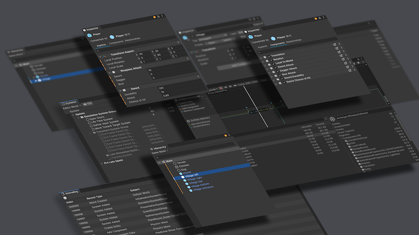

# Entities package

The Entities package is part of Unity's Data-Oriented Technology Stack (DOTS). It provides a data-oriented implementation of the Entity Component System (ECS) architecture. 

For a full list of ECS-related packages, refer to [ECS packages](ecs-packages.md). It is not common to use the Entities package by itself; usually, a combination of Entities Graphics, Unity Physics, and/or Netcode for Entities is used. 

See the [ECS Samples](https://github.com/Unity-Technologies/EntityComponentSystemSamples) for introductory material, including tutorials, samples, and videos.

| **Topic**                       | **Description**                  |
| :------------------------------ | :------------------------------- |
| **[What's new](whats-new.md)**| What's new in the latest version of Entities.|
| **[Upgrade guide](upgrade-guide.md)**| Upgrade to the latest version of Entities.|
| **[Get started](getting-started.md)** | Tutorials and installation information to get started using Entities. |
| **[Entity component system concepts](concepts-intro.md)** | Use the entity component system architecture to organize code.|
| **[Programming in Entities](programming-entities.md)** | Organize your code into systems to manage entities and components in your project. |
| **[Convert data](conversion-intro.md)**|Change GameObject data to ECS data with baking.|
| **[Content management](content-management.md)**|Interface with content archives in your project.|
| **[Entities Unity Editor reference](editor-workflows.md)**| Reference for Entities-specific Unity Editor windows.|
| **[Performance and debugging](performance-debugging.md)**| Analyze and debug your project.|

## Additional resources

* [Getting started](getting-started.md)
* [Upgrade guide](upgrade-guide.md)
* [Entity component system concepts](concepts-intro.md)
* [ECS workflow tutorial](ecs-workflow-tutorial.md)
* [Entity Component System at Unity Discussions](https://discussions.unity.com/lists/ecs)
