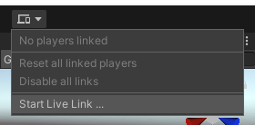

# DOTS Project Setup

Compared to creating a classic Unity project, a few additional steps are required for a DOTS project.

## Package installation

> [!NOTE]
> In all following steps, check each package's documentation to determine which versions of Unity are compatible with the package.

Starting with Unity 2020.1, the DOTS packages are not listed in the package manager, even when preview packages are enabled. There are two alternative options to install those packages:

* You can use "Add package from git URL..." under the **+** menu at the top left of the package manager to add packages either by name (such as `com.unity.entities`), or by git URL (but this option isn't available for DOTS packages). Note that it might take a few moments before the package starts installing.
* Alternatively, you can add DOTS packages by directly editing the `Packages\manifest.json` file in your project. This file requires not only the package name but also a version which can be found by looking at the documentation of each package (such as `"com.unity.entities" : "x.x.x-preview.x"`).

> [!NOTE]
> The use of a Git URL instead of just a name in the Package Manager requires having the git command line tools installed.

Follow the link for more information about [installing hidden packages](https://docs.unity3d.com/Packages/Installation/manual/index.html).

## Recommended packages

Check the overview of the currently available [DOTS packages](https://unity.com/dots/packages).

The recommended set of core packages to be added to a DOTS project is:

* [com.unity.entities](https://docs.unity3d.com/Packages/com.unity.entities@latest)
* [com.unity.rendering.hybrid](https://docs.unity3d.com/Packages/com.unity.rendering.hybrid@latest)
* [com.unity.dots.editor](https://docs.unity3d.com/Packages/com.unity.dots.editor@latest)

## Domain Reload

In most DOTS projects, you'll want to avoid the slow [Domain Reload](https://docs.unity3d.com/Manual/ConfigurableEnterPlayMode.html) that occurs upon entering playmode. To do this, under the `"Edit > Project Settings > Editor"` menu, check the "Enter Play Mode Options" checkbox but leave the "Reload Domain" and "Reload Scene" boxes unchecked. Keep in mind that you must [be mindful of your use of static fields and static event handlers](https://docs.unity3d.com/Manual/DomainReloading.html) when Domain Reloads are disabled.

## Standalone Builds

Making standalone builds of DOTS projects requires installing the corresponding platform package for each of your target platforms:

* [com.unity.platforms.android](https://docs.unity3d.com/Packages/com.unity.platforms.android@latest)
* [com.unity.platforms.ios](https://docs.unity3d.com/Packages/com.unity.platforms.ios@latest)
* [com.unity.platforms.linux](https://docs.unity3d.com/Packages/com.unity.platforms.linux@latest)
* [com.unity.platforms.macos](https://docs.unity3d.com/Packages/com.unity.platforms.macos@latest)
* [com.unity.platforms.web](https://docs.unity3d.com/Packages/com.unity.platforms.web@latest)
* [com.unity.platforms.windows](https://docs.unity3d.com/Packages/com.unity.platforms.windows@latest)

After installing the platform packages you need, create a "Classic Build Configuration" asset for each platform (via the `"Assets > Create > Build"` menu). The properties of that asset will contain a "Scene List", which is the only way of adding subscenes to a standalone project. Make sure you add at least one scene or that the "Build Current Scene" checkbox is toggled on.

> [!WARNING]
> **Do not use** the Build and Run menu "`File > Build and Run`" to build DOTS projects. It might work in some cases but this approach is not supported. You must build your project using the Build or Build and Run buttons at the top of the Build Configuration Asset Inspector window.
>
> In particular, entity subscenes are not included in builds made via the Build and Run menu and will fail to load with the following error message showing up in a development build: "Could not open `<path>/<guid>.entityheader` for read".)

## Live Link Build

In order to connect the editor to a player and have the changes made to the authoring GameObjects synchronized, a Live Link Build has to be created. Simply add the "Live Link" component to the build configuration (and apply the changes).

The build configuration can now be selected in the Live Link menu (right of the Play/Pause/Stop buttons) via "Start Live Link ...". Make sure only one editor is running on the host machine, as having multiple editors running will confuse the player.
