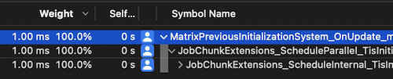

# Job scheduling overhead

Regardless of whether you schedule a job to run on a single thread or multiple threads, there's a small CPU overhead for every job. Before a job can run, Unity must allocate thread memory and copy data so that the job has access to the data it needs to process. 

This CPU overhead is small, but not zero. However, the overhead is considerably less than the time it takes to spin up a dedicated thread in a multithreading system which isn't based around jobs. The overhead might become noticeable in applications that schedule many jobs that run for a short amount of time.

To find out if the main thread spends more CPU time scheduling a job than the job takes to execute, [use the Profiler](xref:um-profiler-introduction) to profile your project. Under the system's profiler marker, if the system only schedules jobs but its marker is larger than the job's marker, you might have scheduling overhead issues.

You can also use [third-party profiling tools](xref:um-performance-profiling-tools) to get more detailed information and find out how much time the scheduling methods actually take.

## Reducing scheduling overhead

If you [profile your project](xref:um-profiler) and it incurs scheduling overhead, consider increasing the amount of useful work that the job does. For example, if several jobs operate on similar sets of data, consider combining the jobs together into a single larger job. If you have scheduled a job to run in parallel across many worker threads, but the work performed by each thread is small, consider scheduling the work to run on a single worker thread instead.

However, if you have a lot of jobs that operate on the same components, and if each of those jobs doesn't have a specific dependency on another previous job, consider combining them into a single job that performs multiple operations on the same set of data. Do as much work as you can reasonably do on data whilst it's in the cache.

## Main thread overhead

It's important to avoid the overhead of moving work back to the main thread. If the main thread work happens before or after other scheduled jobs, running the work synchronously on the main thread might introduce a sync point if it has to wait for jobs that need access to the same data. It might be more effective to incur the scheduling overhead of a small job to avoid a sync point.

It's recommended to run code on the main thread in the following situations:

* When you're prototyping, and you don't want to deal with the inconvenience of jobs until later in development.
* When you're manipulating a tiny amount of data that no other jobs operate on, so you don't generate any sync points, and the job scheduling overhead is therefore larger than any speedup from parallelism.
* When you're doing something that can only be done on the main thread, like [structural changes](concepts-structural-changes.md), interactions with GameObject-based code, or calling core Unity engine APIs that are main-thread-only.

If one of these situations applies, avoid the job system entirely by using an idiomatic `foreach`. This approach still has some CPU overhead because the job dependency system waits for dependencies of other jobs that run on other threads to prevent introducing a race condition.

## Configure job worker count

You can configure the number of worker threads that your application uses with [`JobUtility.JobWorkerCount`](xref:Unity.Jobs.LowLevel.Unsafe.JobsUtility.JobWorkerCount). Set `JobUtility.JobWorkerCount` so that your application uses enough worker threads to perform the work it requires without introducing CPU bottlenecks, but not so many worker threads that they spend a lot of time idle. Reducing the number of worker threads reduces job overhead because there are fewer jobs scheduled by `ScheduleParallel`, but increases the amount of work that each job does.

## Measuring scheduling changes

To test the changes you make, [use the Profiler to collect data](xref:um-profiler-collect-data) and then check the [CPU Usage Profiler module's Timeline view](xref:um-profiler-cpu) to find out where the worker threads in your project spend time.

You can also use native profiling tools such as Instruments to check if the CPU spends more time scheduling the job than it takes to execute it. If the system only schedules jobs but its marker is bigger than the job's marker, then you might have scheduling overhead issues. In the following screenshot, the time spent in `MatrixPreviousInitializationSystem` was only scheduling time because its the only operation this system does. The time took to execute the job was bigger, so the system doesn't have any scheduling overhead issues.

 
## Additional resources

* [The job system](xref:um-job-system)
* [Job dependencies](scheduling-jobs-dependencies.md)
* [The Profiler](xref:um-profiler)
