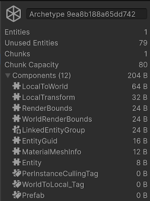

# Manage chunk allocations

One problem that can arise from storing components in 16 KiB [chunks](concepts-archetypes.md#archetype-chunks) is chunk fragmentation. Chunk fragmentation means that archetype chunks aren't being used efficiently. 

Unity stores the components within a chunk contiguously, but this can waste memory if chunks aren't full. Additionally, cache misses happen every time a system has to jump from one chunk to another to process the next entity.

For example, if there are 100,000 entities that all have their own [unique archetype](concepts-archetypes.md), each one of them keeps its component data in a different chunk. Unity then allocates more than 1.5 GB of chunk data (16 KiB x 100,000 chunks), most of it empty. This is more than enough to generate out of memory crashes on some platforms. Furthermore, if your application didn’t run out of memory, every job that operates on an entity encounters a cache miss between each entity. 

## Detect chunk fragmentation

You can use the [Archetypes window](editor-archetypes-window.md) to inspect all archetypes present in your application, along with useful statistics to detect chunk fragmentation. The window displays how much memory each archetype allocated, and how much is unused. 

The Archetypes window also displays the chunk capacity, which is the number of entities that fit in a single chunk. It also displays the number of chunks an archetype allocated, how many entities are being hosted, and how many entities fit in the unused space. A maximum of 128 entities can fit in a chunk, so the chunk capacity will never be higher.

 _Archetypes window with an archetype selected_

You can use this information to check for different cases of chunk fragmentation. First, you can filter by archetypes that have a high number of chunks to find possible cases of chunk fragmentation. Then, you can categorize those cases according to the rest of the states:

* **Large entities:** A low number of unused entities and chunk capacity means that Unity is utilizing chunks well, but if there are a lot of large entities, Unity can't fit many in per chunk.
* **Fragmented archetypes:** A high number of unused entities and chunk capacity means that Unity can fit in more  entities per chunk, but something else other than the entity size is splitting entities in different chunks, for example, when using shared components wrongly.  
* **Too many archetypes:** Having a high number of archetypes with a low chunk count each means that your project has too many entities with different sets of components, for example, when adding and removing components to represent temporary buffs.

## Large entities and chunk fragmentation

The number of entities that can fit into a chunk can be different according to the archetype. This is because a chunk is always 16 KiB, but each entity archetype is represented by a different set of components that contain different amounts of data. A large entity is one which has many components, or components that contain a lot of data. Only a few of these large entities can fit into a chunk. Consequently, iterating over a large set of these entities means the application encounters a higher number of chunk boundaries and subsequent cache misses. 

It’s important to remember that, unlike in object-oriented programming, where a class typically represents a particular type of object or item in your simulation world, there are no objects or items in Entities. There are only components, grouped in various ways. Although it can be convenient to think of an `Entity` as analogous to an object, in reality an entity is little more than an index to a data structure that provides access to one specific collection of components. This means that for example, there’s no particular reason that you need to represent a character in your game as a single entity.

Because an entity is an index to a data structure, you can break down large entities into many smaller entities that can pack into chunks more efficiently. For example, if you divide your character’s components into different entities according to which [system group](systems-write-groups.md) processes them such as AI, pathfinding, physics, animation, or rendering, those system groups can iterate over chunks filled with components that contain only the data they need. For example, the chunks which the physics simulation access have room for more physics components because they aren’t also filled with AI state machine data. For convenience, Unity has a [Character Controller package](https://docs.unity3d.com/Packages/com.unity.charactercontroller@latest) which has mechanisms for creating character controllers.

To make entities lighter, consider extracting common data between entities (for example, enemy stats) into a separated data source, like a [blob asset](blob-assets-intro.md). When accessing data between entities, or when accessing data from an external source, an indirect access is necessary. Usually this overhead should be smaller than the gains from reduced chunk fragmentation, but to be certain, monitor changes with the [Profiler](xref:um-profiler).

Each chunk has a limit of 128 entities, which means that reducing the size of entities stored in a chunk that can fit 128 entities won’t improve fragmentation.

## Shared components and chunk fragmentation

A common cause of chunk fragmentation is incorrect usage of [shared components](components-shared-introducing.md). You can use shared components to group many entities that share the same value for certain components into subgroups. This removes the increased memory footprint of storing a copy of the component data for each entity, and can make certain kinds of data processing more efficient. For example, you can use shared components to implement time-slicing and group the entities by the frames you want Unity to process them in to reduce cache misses.

As a rule, shared components are only useful if all the following statements are true: 

* It’s useful for your systems to operate on individual subgroups.  
* There's a comparatively small number of these subgroups.  
* The memory saved by using shared components rather than standard components is greater than the memory that's lost by creating more chunks.

Sometimes, alternatives like [chunk components](components-chunk.md) can be useful. Chunk components provide a similar functionality to shared components (sharing a value between different entities) but without forcing the fragmentation needed by shared components.

## Prefabs and chunk fragmentation

Another cause of chunk fragmentation is prefabs. You can instantiate prefab entities to dynamically create new entities at runtime, but the prefabs themselves aren’t the same as the entities which are instantiated from them. Prefab entities have a [`Prefab`](xref:Unity.Entities.Prefab) component which causes [entity queries](systems-entityquery-intro.md) to implicitly ignore them. In the following image, the archetype has most of its space unused. The presence of the `Prefab` component in the list makes it a prefab archetype.

 _Archetypes window with an archetype selected_

The `EntityManager` strips this component from the new copies during instantiation, meaning that [systems](systems-intro.md) operate on the instanced entities but leave the original prefab alone. This means that prefabs have a different archetype to the entities they instantiate, and if you load several prefabs with different archetypes, each prefab occupies its own 16 KiB chunk. The memory overheads of these prefabs can add up quickly, so if for example you’re making a procedurally generated game that uses lots of different prefabs, make sure you know how many prefabs are loaded into memory at any one time.

## Reducing the number of archetypes

If having too many archetypes is an issue, consider avoiding having too many different components. The following are reasons why there might be too many different components:

* **Excessive usage of tag components:** Each [tag component](components-tag.md) multiplies the number of archetypes permutations you have by two. You can usually replace a tag component with an [enableable component](components-enableable.md).
* **Temporary addition and removal of components:** If you have temporary data, you should store it in a dynamic buffer so you can add and remove them without changing the entity archetype.
* **Large entities**: Consider splitting entities with too many components based on their common usage to reduce the number of permutations possible.

Finally, consider grouping components at the expense of having unused fields, or even reusing components with the same data for different purposes.

## Additional resources

* [Archetypes concepts](concepts-archetypes.md)
* [Component types](components-type.md)