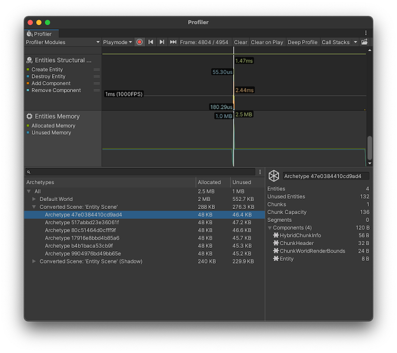

# Entities Memory Profiler module

The Entities Memory Profiler module displays how much memory the [Archetypes](concepts-archetypes.md) in your project used on a per-frame basis. The information available in this module is the same as the [Archetypes window](editor-archetypes-window.md) but you can investigate the data on a per-frame basis. This is helpful to identify where any memory spikes happened, and what Archetypes contributed to performance-intensive actions. 

 _Profiler window with the Entities Memory module displayed_

## Chart categories

The Entities Memory Profiler module displays two charts: **Allocated Memory** and **Unused Memory**, which displays the amount of allocated and unused memory in MB on a per-frame basis.

## Module details pane

When you select the module, the details pane at the bottom of the Profiler window displays further information about the Archetypes that used memory during the capture. The Archetypes are listed by World, with the amount of allocated and unused memory displayed. When you select an Archetype, the information available is the same as that available in the [Archetypes window](editor-archetypes-window.md):

| **Property** | **Description** |
|---|---|
| Archetype name | The Archetype name is its hash, which you can use to find the Archetype again across future Unity sessions. |
| Entities | Number of Entities within the selected Archetype. |
| Unused Entities | The total number of Entities that can fit into all available chunks for the selected Archetype, minus the number of active Entities (represented by the Entities stat). |
| Chunks | Number of [chunks](concepts-archetypes.md#archetype-chunks) this Archetype uses. |
| Chunk Capacity | The number of Entities with this Archetype that can fit into a chunk. This number is equal to the total number of **Entities** and **Unused Entities**. |
| Components | Displays the total number of Components in the Archetype and the total amount of memory assigned to them in KB.   To see the list of Components and their individual memory allocation, expand this section. |
| External Components | Lists the [Chunk Components](components-chunk.md) and [Shared Components](components-shared.md) that affect this Archetype. |

## Additional resources

* [Profiler window](https://docs.unity3d.com/Manual/Profiler.html)
* [Archetypes window](editor-archetypes-window.md)
* [Memory in Unity](https://docs.unity3d.com/Manual/performance-memory-overview.html)