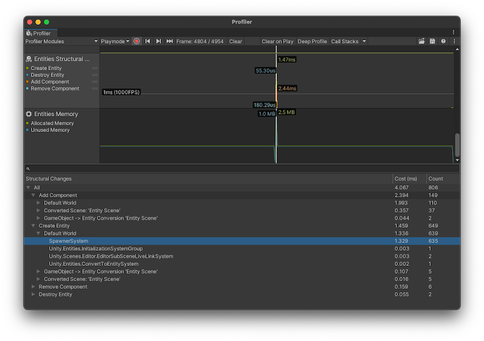

# Entities Structural Changes Profiler module

The Entities Structural Changes Profiler module displays when the ECS framework created or destroyed an Entity, and when it added or removed Components. It can be useful to see this information because when a structural change happens, the ECS framework moves an Entity and a full copy of its data to a different Archetype, which is a performance-intensive operation.

 _Profiler window with the Entities Structural Changes module displayed_

## Chart categories

The Entities Structural Changes Profiler module has four chart categories which displays the amount of time that the following actions took:

* **Creating Entities**
* **Destroying Entities**
* **Adding Components**
* **Removing Components**

For more information about structural changes, see [Structural changes concepts](concepts-structural-changes.md).

## Module details pane

When you select the module, the details pane at the bottom of the Profiler window displays further details on the systems that triggered the structural changes and their respective Worlds.

|**Property**|**Description**|
|---|---|
|Structural Changes|A list of the structural changes that happened in your application, ordered by the World that they happened in. You can expand the World list to see the specific systems that caused the structural changes.|
|Cost (ms)|The time that the structural change took, in milliseconds.|
|Count|The number of times the structural change took place.|

## Additional resources

* [Profiler window](https://docs.unity3d.com/Manual/Profiler.html)
* [Structural changes concepts](concepts-structural-changes.md)
