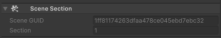

# Scene section overview

Unity groups all the entities in a scene into **sections**, with section 0 the default. Each entity in the scene has a [`SceneSection`](xref:Unity.Entities.SceneSection) [shared component](components-shared.md) which indicates what section that entity belongs to. 

[`SceneSection`](xref:Unity.Entities.SceneSection) contains the GUID of the scene as a [`Hash128`](xref:Unity.Entities.Hash128), and the section number as an integer. 

## Assign a section

If you want to control to what section an entity is assigned to, you can do the following:

* Use the authoring component [`SceneSectionComponent`](xref:Unity.Entities.SceneSectionComponent). This authoring component affects the authoring GameObjects it is present on, and all its children (recursively).
* Write a [custom baking system](baking-baking-systems-overview.md) to set up the [`SceneSection`](xref:Unity.Entities.SceneSection) value directly. You can't assign the value for the [`SceneSection`](xref:Unity.Entities.SceneSection) in a Baker.

Section indices don't need to be consecutive, but the default section 0 is always present even if it's empty. For example you could have the default section `0` and a section with index `123`. 

In the Editor, scene sections are only applied when the subscenes [are closed](conversion-subscenes.md#subscene-component). Opened subscenes have all the entities in section 0.

## Scene sections in the Editor

You can see the details of the scene's section and its GUID in the Editor, in the [Component Inspector](editor-component-inspector.md).

 _Scene Section component in the Editor inspector_

When the [`SubScene`](xref:Unity.Scenes.SubScene) component [is closed](conversion-subscenes.md#subscene-component), the Inspector lists the sections present in that subscene. Section 0 always appears first in the list (without a section index). 

 _Inspector displaying ConvertedScene with the default value, and another ConvertedScene with an index of 123_

## References across sections

In subscenes, ECS components can only contain references to:

* Entities in their same section 
* Entities in section 0. 

>[!IMPORTANT]
> References to entities that are in a different section from the component, or aren't in section 0, are set to `Entity.Null` when they're loaded.

## Section loading

You can load or unload individual sections of a scene independently, but section 0 must always load first. Similarly, you can only unload section 0 once all the other sections in the scene are already unloaded.

To load the content of a specific section, add the component [`Unity.Entities.RequestSceneLoaded`](xref:Unity.Entities.RequestSceneLoaded) to the section meta entity. You can query the [`ResolvedSectionEntity`](xref:Unity.Scenes.ResolvedSectionEntity) buffer on the scene meta entity to access the individual section meta entities.

The following code example loads every other section of a given scene:

[!code-cs[sample](../DocCodeSamples.Tests/StreamingExamples.cs#sceneloading_requestsections)]

In a similar way, to unload the content of a section, remove the component [`Unity.Entities.RequestSceneLoaded`](xref:Unity.Entities.RequestSceneLoaded) from the section meta entity.

## Additional resources

* [Baking overview](baking-overview.md)
* [`SceneSectionComponent` API documentation](xref:Unity.Entities.SceneSectionComponent)